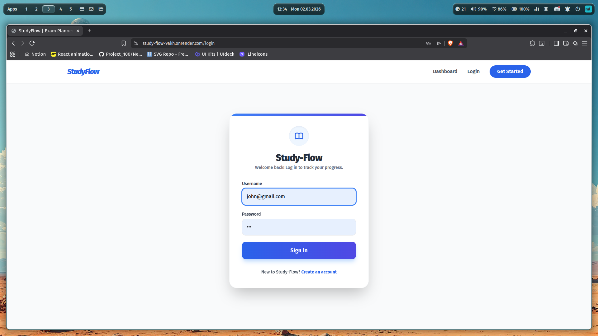
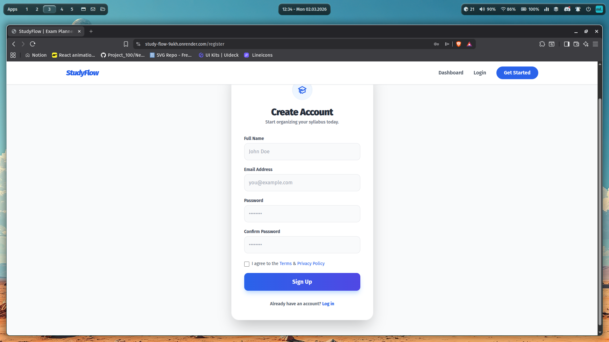
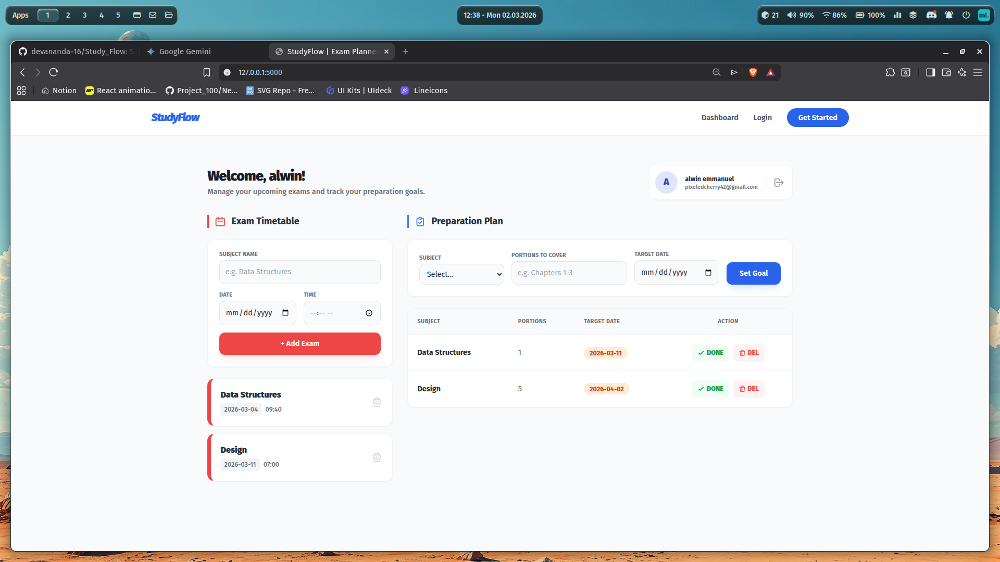

<p align="center">
  
</p>

# StudyFlow 🎯

## Basic Details

### Team Name: No Idea

### Team Members
- Member 1: Devananda T A - AISAT
- Member 2: Dazzlin Figaruz - AISAT

### Hosted Project Link
[ Project hosted link here](https://study-flow-9akh.onrender.com)

### Project Description
StudyFlow is a professional study planning tool that helps students organize, manage, and track academic tasks efficiently to improve productivity and time management.

### The Problem statement
Students struggle to manage study schedules and track academic deadlines effectively. This leads to poor time management, stress, and reduced productivity.

### The Solution
StudyFlow provides a structured digital platform where students can plan their study schedules, track their exam schedule and manage deadlines efficiently. It helps improve time management, reduce stress, and increase academic productivity.

---

## Technical Details

### Technologies/Components Used

**For Software:**
- Languages used: HTML,JavaScript, Tailwind CSS
- Frameworks used: Flask
- Libraries used: Werkzeug (Security/Hashing), SQLite3, Jinja2

- Tools used: VS Code, Git, GitHub, Render

## Features

List the key features of your project:
- Feature 1:  Personalized Study Schedule – Allows     students to create and manage daily and weekly study plans.
- Feature 2: Exam date Tracking – Enables users to add, edit, and monitor exam date and helps to finish the portions according to the exam date.
- Feature 3: Progress Monitoring Dashboard – Displays completed and pending tasks to track academic performance.
- Feature 4:  User Authentication System – Provides secure registration and login for personalized access.

---

## Implementation
Installation
Bash
pip install flask
Run
Bash
python app.py

### For Software:

#### Installation
```bash
 pip install flask
```

#### Run
```bash
python app.py
```

---

## Project Documentation

### For Software:

#### Screenshots (Add at least 3)


*User Login page*


*User registeration page*


*Dashboard page*

---

## Project Demo

### Video
[Demo Video link](study-flow_demo.mp4)

*This video shows that the working of registration , login and dashboard of Learning Flow*

---

## AI Tools Used (Optional - For Transparency Bonus)


**Tool Used:** Gemini, ChatGPT

**Purpose:** 
- "Generated Project folder structure"
- "Enhancing UI"
- "Debugging assistance for python errors"
- "Code review and optimization suggestions"
- "Depolyment setup and understanding"

**Key Prompts Used:**
- "enhance the index.html with tailwind css"
- "Add depolyment files and guidance through depolyment process "
- "Optimize this database query for better performance"

**Percentage of AI-generated code:** [Approximately 40%]

**Human Contributions:**
- Architecture design and planning
- Custom UI color scheme implementation
- Integration and testing
- UI/UX design decisions


---

## Team Contributions

- Devanandha: Frontend development, Backend development, Database design
- Dazzlin Figaruz: UI/UX design, Testing, Documentation, etc.


---


Made with ❤️ at TinkerHub
